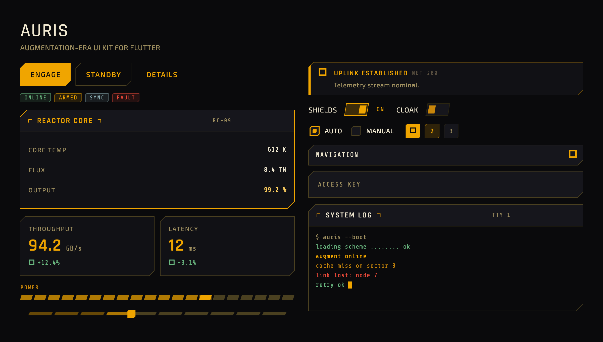
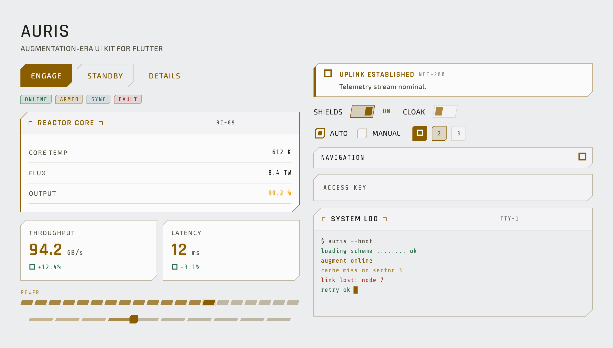
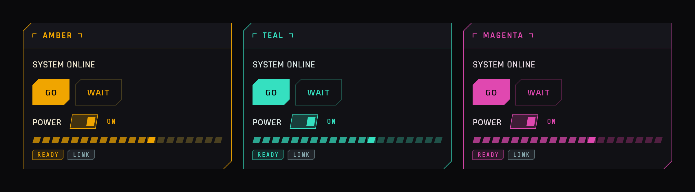

# Auris

A Flutter UI kit and Material 3 theme system with a warm amber-on-near-black,
chamfered **"augmentation-era" sci-fi** aesthetic — the angular, glowing HUD look
of early-2010s sci-fi games, as a drop-in theme plus a library of custom HUD
widgets.



Auris ships as **two cooperating layers**:

1. **`AurisTheme`** — a fully specified `ThemeData`. Add it to your `MaterialApp`
   and every standard Material 3 widget re-skins with no per-widget work.
2. **`auris_widgets`** — standalone HUD widgets for patterns `ThemeData` cannot
   express: segmented meters, chamfered toggles, scrolling terminals, stat
   tiles, targeting-reticle ornaments.

It is **purely presentational** — no state management, routing, or data layer —
and has **zero runtime dependencies** beyond the Flutter SDK.

---

## Install

Requires **Flutter ≥ 3.22** / **Dart ≥ 3.4**.

```yaml
# pubspec.yaml
dependencies:
  auris:
    git:
      url: https://github.com/PointSource/auris.git
```

> Auris is built to be publication-ready but is **not yet on pub.dev** (v0.1.0).
> Until then, depend on it via git or a local `path:`.

The required fonts (Rajdhani, Exo 2, Share Tech Mono) are **bundled** under the
SIL Open Font License — no manual font setup. If a bundled font ever fails to
load, every text role falls back to a platform sans-serif (or monospace for data
readouts), so text always renders rather than showing tofu — there is nothing
for a consumer to configure.

## Usage

```dart
import 'package:auris/auris.dart';
import 'package:flutter/material.dart';

void main() => runApp(const MyApp());

class MyApp extends StatelessWidget {
  const MyApp({super.key});

  @override
  Widget build(BuildContext context) {
    return MaterialApp(
      theme: AurisTheme.dark(),   // canonical amber-on-near-black
      home: const HomePage(),
    );
  }
}
```

That single line re-skins your existing Material widgets. Reach for the custom
widgets where you need the HUD patterns Material has no equivalent for:

```dart
import 'package:auris/auris_widgets.dart';

AurisPanel(
  title: 'REACTOR CORE',
  code: 'RC-09',
  accent: true,
  child: Column(
    children: const [
      AurisDataRow(label: 'CORE TEMP', value: '612 K'),
      AurisDataRow(label: 'OUTPUT', value: '99.2 %', highlight: true),
    ],
  ),
)
```

## Light & dark variants

`AurisTheme.dark()` is the canonical look; `AurisTheme.light()` is a clean
technical light variant that keeps the same amber identity (accent darkened for
AA contrast on light surfaces). Both are one resolution with a different
`Brightness` input and accept the same overrides.



## Customize without forking

Pass an `accent` color, a `bevelScale`, or a `glowScale` and the change
propagates through **both** the themed Material widgets and the custom widgets —
including widget-synthesized glows — from one resolved scheme:

```dart
MaterialApp(
  theme: AurisTheme.dark(
    accent: const Color(0xFF35E0C0), // recolors the whole kit
    bevelScale: 1.0,                 // corner cut size
    glowScale: 1.5,                  // glow intensity (alpha, not blur)
  ),
);
```



## API

Two import surfaces:

- **`package:auris/auris.dart`** — the theme layer: `AurisTheme` (the `ThemeData`
  factory), `AurisScheme` (the resolved design scheme that custom widgets read
  from via `Theme.of(context).extension<AurisScheme>()`), and the design tokens.
- **`package:auris/auris_widgets.dart`** — the standalone HUD widget library (the
  [custom widgets](#custom-widgets) reference below).

`AurisTheme` exposes two static constructors, each returning a fully specified
`ThemeData` for a `MaterialApp`:

| Constructor | Returns |
| --- | --- |
| `AurisTheme.dark({Color? accent, double bevelScale = 1.0, double glowScale = 1.0})` | Canonical amber-on-near-black theme. |
| `AurisTheme.light({Color? accent, double bevelScale = 1.0, double glowScale = 1.0})` | AA-tuned light variant, same amber identity. |

The `accent` / `bevelScale` / `glowScale` overrides resolve into a single
`AurisScheme` that propagates through both the themed Material widgets and the
custom widgets — see [Customize without forking](#customize-without-forking).
[`SPEC.md`](SPEC.md) (§spec:scheme, §spec:customization) is the full reference.

## Custom widgets

All custom widgets read their design values from the resolved `AurisScheme`, so
they honor accent / bevel / glow overrides and the brightness variant
automatically.

| Widget | Purpose |
| --- | --- |
| `AurisContainer` | Foundation chamfered box (border + fill + glow); everything composes from it. |
| `AurisPanel` | Titled card with corner-bracket ornaments and an optional accent (glowing) mode. |
| `AurisBadge` | Small monospace status tag (amber / gold / slate / danger / success / inactive). |
| `AurisNotification` | Inline alert banner with accent bar, icon, message, and dismiss. |
| `AurisStatCard` | KPI tile: label, large glowing value, unit, and signed delta. |
| `AurisDataRow` | Key/value row with monospace value, divider, and optional highlight. |
| `AurisProgressBar` | Segmented meter — the preferred linear-progress replacement. |
| `AurisSwitch` | Toggle with a true chamfered/slanted track and thumb. |
| `AurisRadio` | Single-select with a chamfered indicator (Material's radio is circular). |
| `AurisSelect` | Dropdown with a rotating caret and a chamfered glowing popup. |
| `AurisStepIndicator` | Chamfered step marker for `Stepper.stepIconBuilder` or standalone. |
| `AurisTerminal` | Auto-scrolling monospace log, colored per line type, with a blinking cursor. |
| `AurisHexOrnament` | Ambient hex-cluster background detail. |
| `AurisScanBracket` | Targeting-reticle corner brackets around a child. |

## Complete Material coverage

The theme layer's promise is that **no standard widget renders with default
Material styling**. Coverage is measured by a census of every `ThemeData`
component-theme slot — not by what the demo happens to show — so widgets a real
app reaches for (date/time pickers, scrollbars, banners, menus, navigation
drawers, toggle buttons, …) are in scope, each populated or deliberately
excluded with a recorded reason. See [`SPEC.md`](SPEC.md) (§spec:theme-layer).

## Example & docs

- **`example/`** — a single scrollable showcase app demonstrating every
  component. Run it with `flutter run` from `example/`.
- **[`SPEC.md`](SPEC.md)** — the solution-space source of truth (architecture,
  tokens, theme layer, custom widgets, accessibility, motion).
- **[`REQUIREMENTS.md`](REQUIREMENTS.md)** / **[`ROADMAP.md`](ROADMAP.md)** —
  problem space and remaining work.

## Accessibility & performance

Primary text and interactive controls meet **WCAG AA** contrast; intentionally
dim tokens are decorative-only. Every interactive widget exposes visible
keyboard focus. Animations respect the platform reduced-motion setting and the
showcase targets 60fps including glow, chamfer clipping, and segmented bars.

## License

BSD 3-Clause — see [`LICENSE.md`](LICENSE.md).
